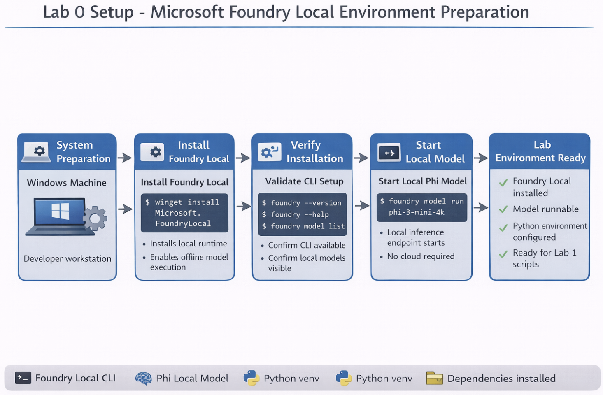
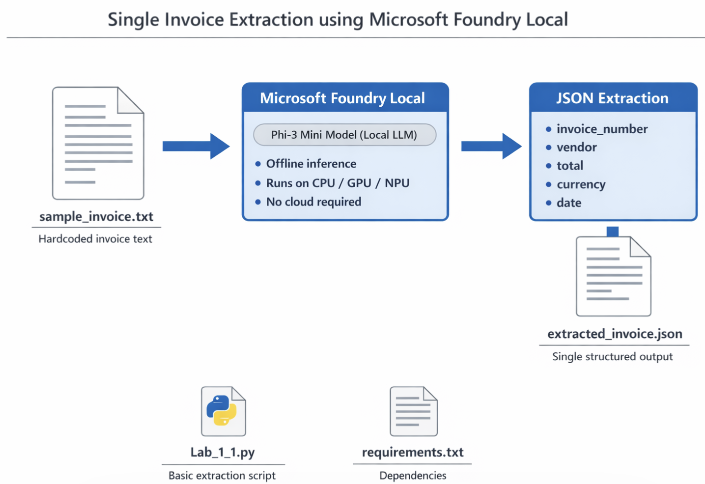
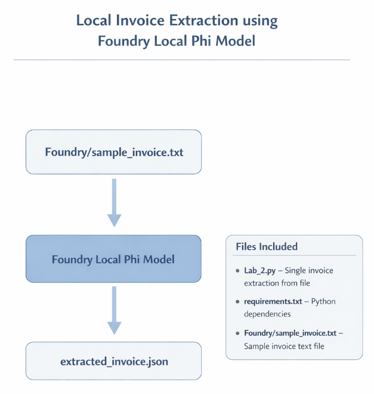
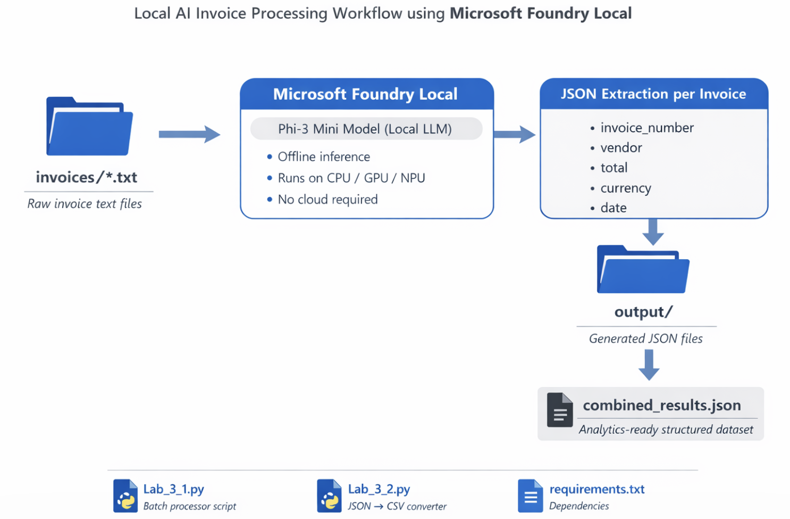
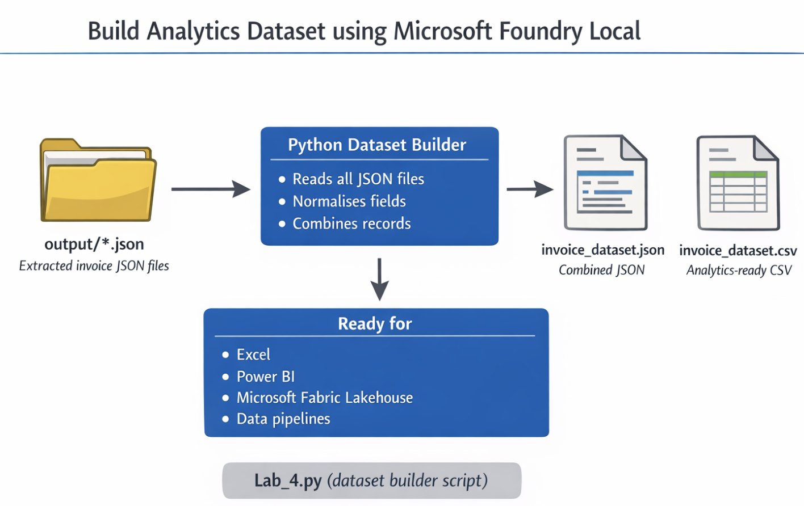
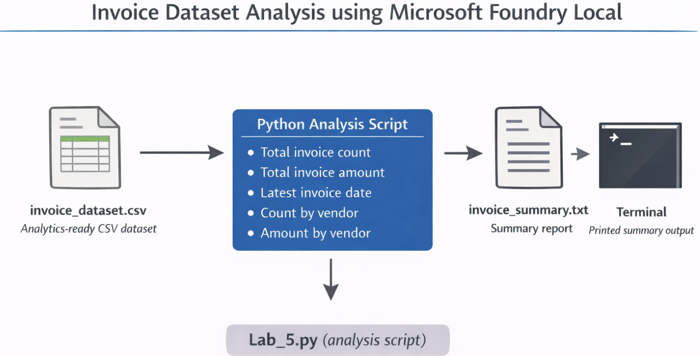

# Foundry Local Lab 4 – Batch Invoice Processing

## What this exercise does

This lab processes multiple invoice text files from the `invoices` folder using a local Phi model with Microsoft Foundry Local.

Flow:

invoices/*.txt
↓
Foundry Local Phi model
↓
JSON per invoice
↓
output folder
↓
combined_results.json

## Files included

. `invoice_batch_pipeline.py` – batch processing script
. `convert_results_to_csv.py` – optional converter from combined JSON to CSV
. `requirements.txt` – Python dependencies
. `invoices/` – sample invoice text files
. `output/` – output folder for generated results

## Setup

1. Open this folder in VS Code.
2. Open Terminal.
3. Activate your virtual environment if you use one.
4. Install dependencies:

```bash
pip install -r requirements.txt
```

## Run the batch invoice pipeline

```bash
python invoice_batch_pipeline.py
```

## Optional: convert combined JSON to CSV

```bash
python convert_results_to_csv.py
```

## Output files

The script creates:

. `output/invoice_001.json`
. `output/invoice_002.json`
. `output/invoice_003.json`
. `output/combined_results.json`

Optional CSV:

. `output/combined_results.csv`

## Important note about Phi model alias

This package uses:

```python
MODEL_ALIAS = "phi-3-mini-4k"
```

Before running, verify your machine supports that exact alias:

```bash
foundry model list
```

If your machine shows a different Phi alias, update `MODEL_ALIAS` in `invoice_batch_pipeline.py`.

# Foundry Local – Invoice AI Example

## Overview
This project demonstrates how to run a local LLM using Microsoft Foundry Local and extract invoice data as structured JSON across multiple labs.

---

# Foundry Local Lab 0 – Setup

## What this exercise does

This lab prepares your environment to run Microsoft Foundry Local with a local Phi model.



## Setup steps

1. Install Foundry Local CLI
2. Verify installation
3. Run a local model
4. Create Python virtual environment
5. Install SDK dependencies

## Commands

```bash
winget install Microsoft.FoundryLocal
foundry --version
foundry --help
foundry model list
foundry model run phi-3-mini-4k
python -m venv .venv
.venv\Scripts\activate
pip install foundry-local-sdk-winml openai
```

---

# Foundry Local Lab 1 – Single Invoice Extraction

## What this exercise does

This lab runs a single invoice extraction prompt against a local Phi model using Microsoft Foundry Local.

It demonstrates two variants:

. `Lab_1_1.py` – standard non-streaming response
. `Lab_1_2.py` – streaming response printed token by token

## Files included

. `Lab_1_1.py` – basic single invoice extraction
. `Lab_1_2.py` – streaming single invoice extraction
. `requirements.txt` – Python dependencies

## Setup

1. Open this folder in VS Code.
2. Open Terminal.
3. Activate your virtual environment if you use one.
4. Install dependencies:

```bash
pip install -r requirements.txt
```

## Run Lab 1



Run the standard response version:

```bash
python Lab_1_1.py
```

Run the streaming version:

```bash
python Lab_1_2.py
```

## Expected output

Both scripts send a sample invoice to the local model and return JSON with fields such as:

. `invoice_number`
. `vendor`
. `total`
. `currency`
. `date`

## Important note about Phi model alias

These scripts use:

```python
phi-3-mini-4k
```

Before running, verify your machine supports that exact alias:

```bash
foundry model list
```

If your machine shows a different Phi alias, update the model name in `Lab_1_1.py` and `Lab_1_2.py`.

---

# Foundry Local Lab 2 – Single Invoice Extraction from File

## What this exercise does

This lab extracts structured JSON data from a single invoice file (`Foundry/sample_invoice.txt`) using a local Phi model with Microsoft Foundry Local.



## Files included

. `Lab_2.py` – single invoice extraction from file
. `requirements.txt` – Python dependencies
. `Foundry/sample_invoice.txt` – sample invoice text file

## Setup

1. Open this folder in VS Code.
2. Open Terminal.
3. Activate your virtual environment if you use one.
4. Install dependencies:

```bash
pip install -r requirements.txt
```

## Run Lab 2

```bash
python Lab_2.py
```

## Output files

The script creates:

. `extracted_invoice.json`

## Important note about Phi model alias

This script uses:

```python
"phi-3-mini-4k"
```

Before running, verify your machine supports that exact alias:

```bash
foundry model list
```

If your machine shows a different Phi alias, update the model name in `Lab_2.py`.

---

# Foundry Local Lab 3 – Batch Invoice Processing

## What this exercise does

This lab processes multiple invoice text files from the `invoices` folder using a local Phi model with Microsoft Foundry Local.



## Files included

. `Lab_3_1.py` – batch processing script
. `Lab_3_2.py` – optional converter from combined JSON to CSV
. `requirements.txt` – Python dependencies
. `invoices/` – sample invoice text files
. `output/` – output folder for generated results

## Setup

1. Open this folder in VS Code.
2. Open Terminal.
3. Activate your virtual environment if you use one.
4. Install dependencies:

```bash
pip install -r requirements.txt
```

## Run the batch invoice pipeline

```bash
python Lab_3_1.py
```

## Optional: convert combined JSON to CSV

```bash
python Lab_3_2.py
```

## Output files

The script creates:

. `output/invoice_001.json`
. `output/invoice_002.json`
. `output/invoice_003.json`
. `output/combined_results.json`

Optional CSV:

. `output/combined_results.csv`

## Important note about Phi model alias

This package uses:

```python
MODEL_ALIAS = "phi-3-mini-4k"
```

Before running, verify your machine supports that exact alias:

```bash
foundry model list
```

If your machine shows a different Phi alias, update `MODEL_ALIAS` in `Lab_3_1.py`.

---

# Foundry Local Lab 4 – Build Analytics Dataset from Extracted Invoice JSON

## Purpose

This exercise combines multiple JSON outputs from Foundry Local invoice extraction into a single analytics-ready dataset.



## Folder structure

```
output/
	invoice_001.json
	invoice_002.json
	invoice_003.json
```

## Run the script

```bash
python Lab_4.py
```

## Output files created

. `invoice_dataset.json`
. `invoice_dataset.csv`

These files are ready for:

. Excel
. Power BI
. Microsoft Fabric Lakehouse
. Data pipelines

---

# Foundry Local Lab 5 – Analyze Invoice Dataset

## Purpose

This exercise analyzes the invoice dataset created from previous labs.



## Files included

. `invoice_dataset.csv` – sample analytics-ready CSV dataset
. `invoice_dataset.json` – sample combined JSON dataset
. `Lab_5.py` – Python script for summary analysis
. `requirements.txt` – optional Python dependencies
. `README.md` – run instructions

## What the script calculates

. Total number of invoices
. Total invoice amount
. Latest invoice date
. Invoice count by vendor
. Total amount by vendor

## Run steps

```bash
pip install -r requirements.txt
python Lab_5.py
```

## Output

The script creates:

. `invoice_summary.txt`

and also prints the summary in the terminal.

## Next step

This dataset can now be loaded into:

. Excel
. Power BI
. Microsoft Fabric Lakehouse
. Notebook-based analytics

---

## Project Structure

```
Local Foundry/
├── Lab_0.png                          # Lab 0 setup diagram
├── Lab_1_1.png                        # Lab 1 non-streaming diagram
├── Lab_1_1.py                         # Lab 1 non-streaming script
├── Lab_1_2.py                         # Lab 1 streaming script
├── Lab_2.png                          # Lab 2 single file diagram
├── Lab_2.py                           # Lab 2 single file script
├── Lab_3.png                          # Lab 3 batch processing diagram
├── Lab_3_1.py                         # Lab 3 batch processing script
├── Lab_3_2.py                         # Lab 3 CSV converter script
├── Lab_4.png                          # Lab 4 dataset builder diagram
├── Lab_4.py                           # Lab 4 dataset builder script
├── Lab_5.png                          # Lab 5 analysis diagram
├── Lab_5.py                           # Lab 5 analysis script
├── README.md                          # This file
├── requirements.txt                   # Python dependencies
├── Lab0_Foundry_Local_Setup.docx      # Detailed setup guide
├── Foundry/
│   └── sample_invoice.txt             # Sample invoice for Lab 2
├── invoices/
│   ├── invoice_001.txt
│   ├── invoice_002.txt
│   └── invoice_003.txt
└── output/
	├── combined_results.json
	├── invoice_001.json
	├── invoice_002.json
	└── invoice_003.json
```

---

## Quick Start

1. **Lab 0**: Set up your environment
2. **Lab 1**: Learn basic invoice extraction
3. **Lab 2**: Extract from a file
4. **Lab 3**: Process multiple invoices in batch
5. **Lab 4**: Build an analytics dataset
6. **Lab 5**: Analyze the dataset

Each lab builds on the previous one. Start with Lab 0 and follow through Lab 5!
